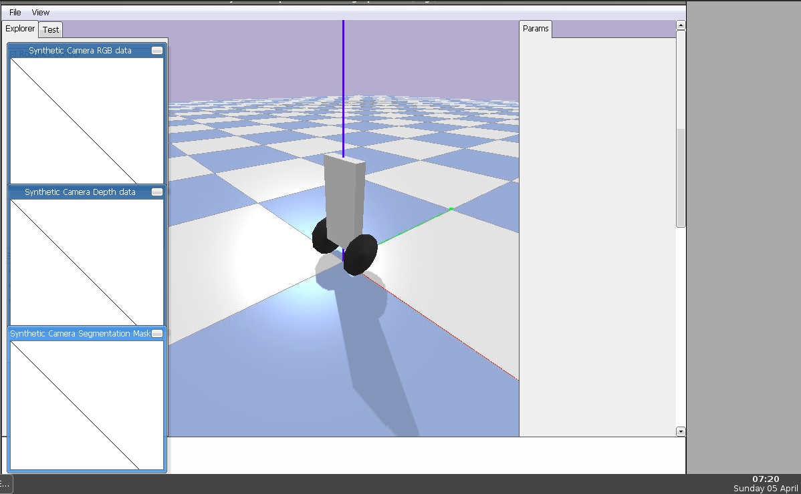

# Task 4: 
## Evolve solution for one locomotion problem with the original (for reinforcement learning) and the modified (for evolutionary algorithms) reward functions.

### Questions: 
> Describe the difference between the two functions. Describe how the behaviour of the evolved robots differ.

The original one is summary of: 
* alive - shows if the robot height above ground and rpy is just pitch (like not 'fallen').
* progress - it's the movement of the robot in the direction toward the target. 
* electricity_cost -  it's a penalty due to cost of using robot's motors.
* joints_at_limit_cost - it's a penalty due to stucking joints of the robot. 
* feet_collision_cost - it's a penalty given if there are touching another leg of other objects, that makes robot avoiding smashing feet into itself.

The modified one (for example, for humanoid) is summary of: 
* progress - it's the movement of the robot in the direction toward the target. Also, numpy function "clip" is implemented to give progress between -1 and 1.
* 1.0 - bonus that robot receives to avoid falling down.
* feet_cost - shows if both of the feet on the ground or not. Also, there is condition rule that gives penalty -1.0 if both feet not on the ground, and -0.33 if both feet on the ground somehow
* joints_at_limit_cost - it's a penalty due to stucking joints of the robot. 
* angle_offset_cost - it's the penalty that shows how much is angle offset between the robot and the target.

And for each environment the reward function differs.

I ran environments (halfcheetah and humanoid) with both of reward functions simultaneously. And I noticed, that the second one gave better results, and agents even were able to move forward the target. While evolved on the first reward function robots weren't so good at it... For me, they have fallen down every time either on the start or in few seconds.

#### 

> Try to explain why the modified reward function are more suitable for evolutionary strategies that the original reward function which has been optimized for reinforcement learning algorithms. 

The idea of evolutionary algorithm is that there're crowd of agents are being learned at the same time ( in one generation). After that, the algorithm choose the best ones and "make children" from them in order to start the next generation. And start evolving again. This loops until some break rule happens.

As to reward functions, I saw that the modified one has more adequate and suitable sum of rewards. There is implemented some conditions of touching the ground by feet and number of steps toward the target. Also, there is introduced angle offset between target and robot. Additionally, if I am correct, on the original one there is alive parametes in reward function that may constraint the robot moves (it makes him moving only with pitch angle rotating)

# Task 5: 
## Implementing a new Gym/Bullet environment

> This section includes a guideline for creating and using a new Gym environment from scratch. It is an adapted version of a tutorial developed by Backyard Robotics available from https://backyardrobotics.eu/2017/11/27/build-a-balancing-bot-with-openai-gym-pt-i-setting-up/. This will constitute the Exercise 5. The problem concerns a simple wheeled robot that can be trained for the ability to balance. We can thus name the environment BalancebotBulletEnv-v0 and the folder containing the implementation of the environment balance-bot. The robot will be simulated by using the PyBullet dynamic simulator.

I went through all the instructions in the guide and on the site given below. And I got the balance bot environment, which I evolved later. And I got desirable results: this two-wheeled robot balance itself very good.

<!--  -->

#### All the files you can find in folders.

# Task 6: 
## Kinematic Simulations

In this section I familiarized with kinematic simulations of robots.